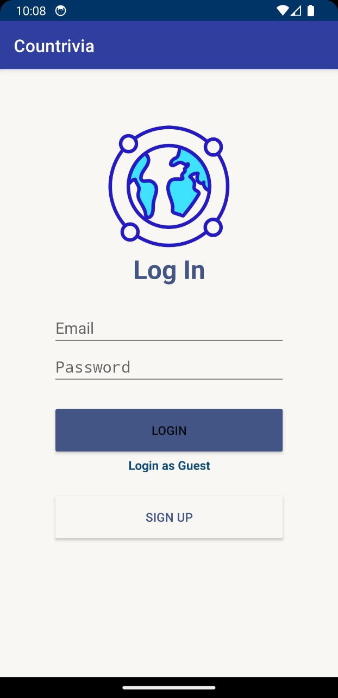
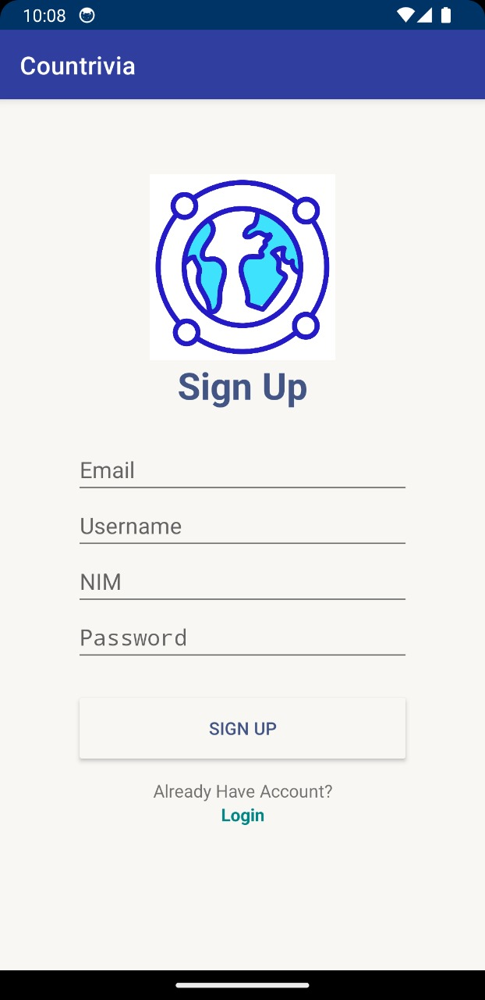
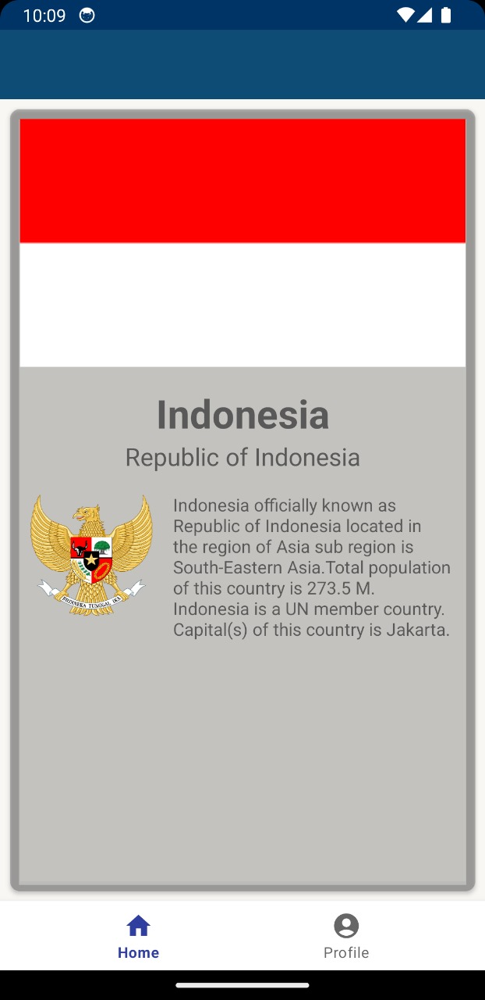
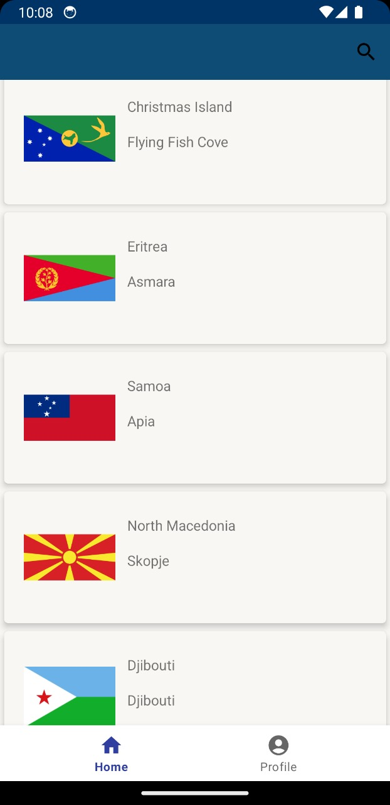
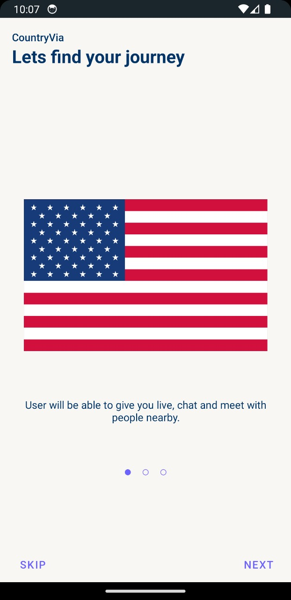
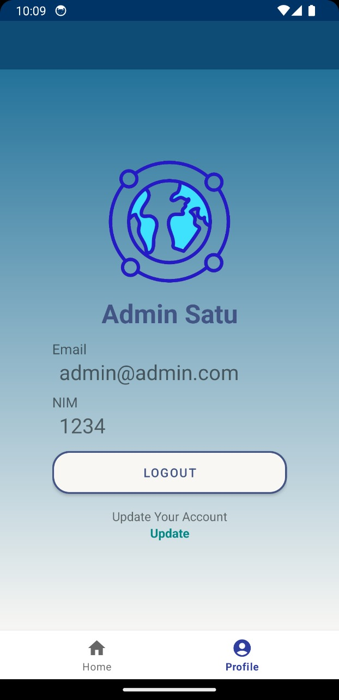

    # Countrivia

## About App
"Countrivia is an application that provides comprehensive information about various countries around the world, allowing users to explore and mark their favorite countries in a 'Wishlist' for their dream travels."	

## Our Team
1. Andreas Sihotang - 121140168
2. Abdur Rohman - 121140136
3. Martin Ompusunggu - 121140144
4. Daffa Abdurrahman Jatmiko - 121140181

## Application Architecture
1. MVVM Architecture Pattern based on Kotlin Language
2. OnBoarding with Motion Layout
3. RecyclerView with SearchView
4. API Service with Retrofit
5. API Interceptor with Okhttp3
6. RestCountriesApi Implementation
7. Local Database with Room DB
8. Dagger-Hilt Implementation

## Snapshots
1. 
2. 
3. 
4. 
5. 
6. 

## Dependencies Used
- Preference DataStore
- Navigation
- Dagger-Hilt
- Retrofit with Okhttp3
- Room Database
- Glide
- Viewpager2
- Stepper

## Issues
Feel free to fork this repository and report any issue

##
**Final Project Pengembangan Aplikasi Mobile IF-3026 / Institut Teknologi Sumatera**
